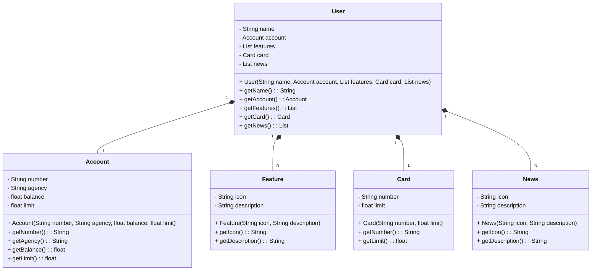

#Projeto Dio da Dev week Santander 2023
Java RESTful API criada para Santander dev WEek

## Diagrama de classes

```mermaid
classDiagram
  class User {
    - String name
    - Account account
    - List<Feature> features
    - Card card
    - List<News> news
    + User(String name, Account account, List<Feature> features, Card card, List<News> news)
    + getName(): String
    + getAccount(): Account
    + getFeatures(): List<Feature>
    + getCard(): Card
    + getNews(): List<News>
  }

  class Account {
    - String number
    - String agency
    - float balance
    - float limit
    + Account(String number, String agency, float balance, float limit)
    + getNumber(): String
    + getAgency(): String
    + getBalance(): float
    + getLimit(): float
  }

  class Feature {
    - String icon
    - String description
    + Feature(String icon, String description)
    + getIcon(): String
    + getDescription(): String
  }

  class Card {
    - String number
    - float limit
    + Card(String number, float limit)
    + getNumber(): String
    + getLimit(): float
  }

  class News {
    - String icon
    - String description
    + News(String icon, String description)
    + getIcon(): String
    + getDescription(): String
  }

  User "1" *--  "1" Account
  User "1" *-- "N" Feature
  User "1" *-- "1" Card
  User "1" *-- "N" News
```

##
https://railway.app/account
